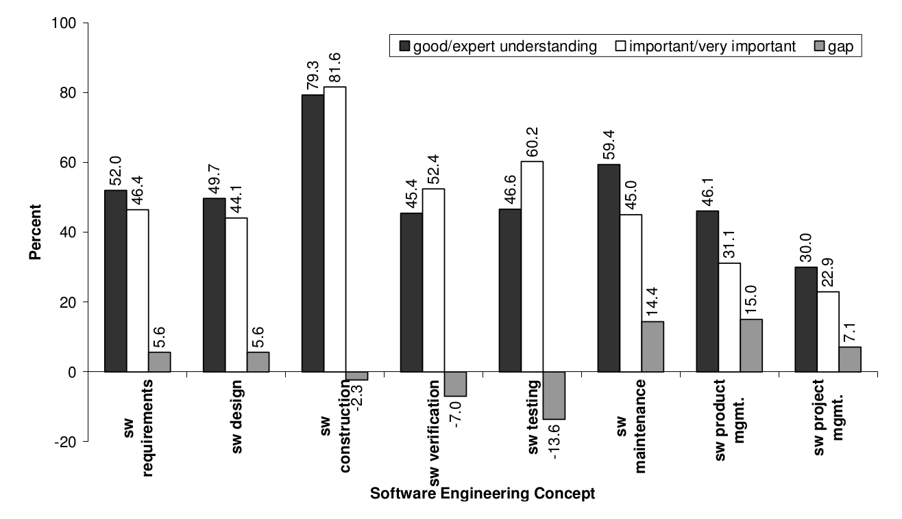

Makefiles
=========

- - - - -

...but first...
===============

- - - - -

Quiz on [HMS+09]
----------------

Only those taking the course for credit need to answer these questions

1. In 1 or 2 sentences at most, describe what the article is discussing.
2. In 1 or 2 sentences at most, describe one conclusion the article makes.

- - - - -

Quotes from [HMS+09]
--------------------

...both developing and using scientific software is of very high
importance for scientists’ own research. Almost half of the
respondents stated that they believe developing scientific software is
important for other scientists.

- - - - -

Quotes from [HMS+09]
--------------------

- - - - -

Quotes from [HMS+09]
--------------------

First, there is a general lack of formal training in programming and
software development among scientists.  Second, the training that
scientists do receive is often supplied by a computer science
department, which gives general software courses that scientists might
not see the relevance of. A third aspect is that scientists may not
see the need for more formal training in programming or software
development. Codes often start out small and only grow large with time
as the software proves its usefulness in scientific
investigations. The demand for proper software engineering is
therefore seldom visible until it is `too late'.

- - - - -

Quotes from [HMS+09]
--------------------

However, many engineering programs have, in fact, removed programming
courses and formal training in, e.g., numerical methods from the
curriculum. Since our findings clearly suggest that scientific
software is becoming increasingly more important and that an
increasing amount of time is spent on both developing and using
scientific software, one can ask if such moves are in the right
direction.

- - - - -

Makefiles
=========

- - - - -

No class on Tuesday (11 Sept)
=============================

- - - - -

Project 1
---------

Perform a search for software which is pertinent to your field of
expertise and write a report of your findings. The goal is to identify
and compare different projects and become aware of what is available
to you in your work. Be sure to address aspects such as:

1. Is the code commercial? open source?
2. How is the code disseminated? direct download? version control?
3. Is the code under active development?
4. Which languages does the project use?
5. Is there documentation? How helpful is it? Can you figure out how
to use the software?
6. Is the code suitable for high performance computing? Does it handle
large datasets?
7. Are there papers written on components of the code? What kinds of
results do they present?

- - - - -

Project 1
---------

The report is due 1 week from today at the beginning of class (15
Sept, 4:00pm). Please bring the report printed and stapled. You should
not exceed 5 pages of text.

Your reports will be graded based on the following criteria:

1. How thoroughly did you search? I want to see that you looked hard
and compared several projects. Ultimately my hope is that you find
something useful in your research.
2. What is the quality of information you are presenting? The report
should not be too short but at the same time you need to communicate
all the information. You should treat this as a report you are writing
to your boss, upon which he will decide which software to
use/purchase.
3. How well is the report written? Did you carefully check the
grammar, spelling, and organization? How easy is it to follow and
read?

