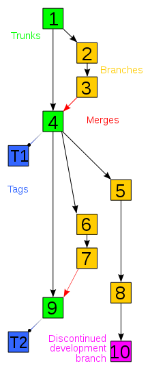

Version Control
===============

- - - - -

Common tricks
-------------

Keeping many versions of things is a natural need. You write code /
paper / CV and need at times to make changes. Typically, we use one or
more of the following practices:

* Each version is a different file and has a different
  filename. (MyCV.doc, MyCVbak.doc, MyCVsave.doc, MyCVold.doc)
* If we are clever we even use a date or number in the
  name. (MyCVDec10, MyCVJun09, MyCV1.doc, MyCV2.doc)
* You may even use shared folders (like DropBox) to work on
  collaborative projects with friends (who hopefully name separate
  files of their own.)

- - - - -

Has this happened to you?
-------------------------

### Scene 1

You use a code to write a paper and then submit it to a journal. While
you wait for the reviews, you modify your code to solve a new problem
for another paper (man you are productive!). The reviews of the first
paper come back and require that you reproduce some of your old
results. However, you have NO idea where the old version of the code
is.

### Scene 2

You are working on a code project with several group members. You each
are working in a separate part of the code to help avoid conflicts in
versions. However, your additions unfortunately touch pieces of code
your friends were changing. You create multiple backups as you try to
merge the work together, but in the end make a mistake and have no
idea how to rectify it.

- - - - -

Source Control HOWTO
--------------------

### Quote

Our universities often don't teach people how to do source control.
We graduate with Computer Science degrees.  We know more than we'll
ever need to know about discrete math, artificial intelligence and the
design of virtual memory systems.  But many of us enter the workforce
with no knowledge of how to use any of the basic tools of software
development, including bug-tracking, unit testing, code coverage,
source control, or even IDEs. Our employers don't teach people how to
do source control.  In fact, many employers provide their developers
with no training at all.

- - - - -

Why use this?
-------------

* Backup and Restore. Files are saved as they are edited, and you can
  jump to any moment in time. Need that file as it was on Feb 23,
  2007? No problem.
* Synchronization. Lets people share files and stay up-to-date with
  the latest version.
* Short-term undo. Monkeying with a file and messed it up? (That’s
  just like you, isn’t it?). Throw away your changes and go back to
  the `last known good' version in the database.
* Long-term undo. Sometimes we mess up bad. Suppose you made a change
  a year ago, and it had a bug. Jump back to the old version, and see
  what change was made that day.
* Track Changes. As files are updated, you leave messages
  explaining why the change happened. This makes it easy to see how a
  file is evolving over time.
* Track Blame/Ownership. All changes come with a tag including who
  made the change. This is great for assigning blame...er... credit.
* Sandboxing, or insurance against yourself. Making a change? You can
  make temporary changes in an isolated area, test and work out the
  kinks before `checking in' your changes.

- - - - - 

Graphical
---------

- - - - - 

Sample Repositories
===================

- - - - -

Best Practices
==============

- - - - -

What to checkin/commit?
-----

Although you can store anything you want in a repository, that doesn't
mean you should. The best practice here is to store everything which
is necessary to do a build, and nothing else. I call this "the
canonical stuff".

To put this another way, I recommend that you do not store any file
which is automatically generated. Checkin your hand-edited source
code. Don't checkin executeables or object files. If you use a code
generation tool, checkin the input file, not the generated code
file. If you generate your product documentation in several different
formats, checkin the original format, the one that you manually edit.

If you have two files, one of which is automatically generated from
the other, then you just don't need to checkin both of them. You would
in effect be managing two expressions of the same thing. If one of
them gets out of sync with the other, then you have a problem.

- - - - -

Checking files in/commiting
---------------------------

### Run diff just before you checkin

You have been working hard on your new feature and now you are ready
to make a commit to your system. Never checkin your changes without
giving them a quick review in some sort of a diff tool. What have you
changed? Are all the changes meaningful and/or intended?

### Commit often

Commit changes often and based on functionality. Say that you added
two features which changed 4 files in total. One feature changed 3
files, commit this one separately. Then commit the second feature
involving the final file. This makes it easier to diagnose problems
later. When you commit, use meaningful comments.

- - - - -

As you work
-----------

### Don't break the repository

If possible, don't make commits which break the code. At all times,
the contents of the repository should be in a state which allows
everyone on the team to continue to work.  If a developer checks in
some code which won't build or won't pass the test suite, the entire
team grinds to a halt.

### Keep the repository in sight

Keep in touch with the repository. Update your working folder as often
as you can without interrupting your own work. Commit your work to the
repository as often as you can without breaking the build. It isn't
wise to let the distance between your working folder and the
repository grow too large.

- - - - -

Host your repositories online
-----------------------------

* bitbucket.org - great account status for academics
* github.com - free but your code is opensource
* googlecode.com - also free but your code is opensource

